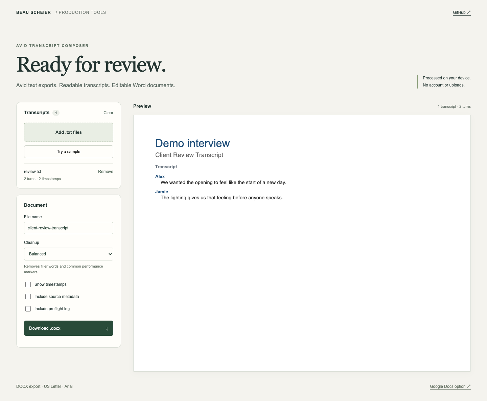

# TranscriptTamer

Turn Avid transcript text exports into editable DOCX review documents, directly in your browser. Google Docs remains an optional workflow.

[Open TranscriptTamer](https://tools.observe.report/TranscriptTamer)



## Browser DOCX export

Add `.txt` exports, review speaker turns and preflight notes, choose cleanup and metadata options, then download a `.docx`. Multiple transcripts are sorted by filename and start on separate pages in one document.

**Your transcripts stay on your device.** Parsing, preview and DOCX generation run in the browser. No Google account, Word installation, Python installation, upload endpoint or paid conversion service is required. The static site supplies the Python/WebAssembly runtime on the first export (approximately 15 MB of runtime assets before HTTP compression). A network connection is needed to load the app/runtime; this release is not an installable offline app.

Features:

- Multiple files, optional timestamps, project/clip/source metadata and a preflight log.
- Light, balanced and aggressive cleanup, with preview using the same prepared text as the export.
- Arial speaker turns, 1.15 dialogue spacing, US Letter pages with one-inch margins.
- Explicit errors for unreadable/empty files, cancellation and download failure recovery.
- Up to 50 files, 10 MB of input and 5 million text characters per batch. The preview shows up to 300 turns; the DOCX includes the full batch.

Use Light when filler words and performance markers should remain. All modes normalize whitespace, smart quotes and dashes. Balanced removes selected filler words and markers; Aggressive additionally removes selected stutters. Cleanup is heuristic: inspect the result, especially numbers, URLs and unusual speaker labels. The preview shows document content and styling, not exact word-processor pagination.

## Run locally

Development/build requires Node.js 22+ and Python 3.9+ (use a supported Python release for ongoing development):

```sh
npm ci
npm test
npm run demo
```

The preview server listens on port 8790. Use the host address reachable from your browser. To host elsewhere, run `npm run build:demo` and serve the contents of `demo/` as static files over HTTP or HTTPS, including `vendor/`, `licenses/` and the exporter. Opening the HTML directly from disk is not supported.

The production site is a Cloudflare Worker with static assets at `tools.observe.report/TranscriptTamer`. The Worker only routes requests and applies response headers; no transcript processing runs on Cloudflare.

```sh
npm run build
npm run test:production
npm run deploy
```

Deployment requires an authorized Cloudflare account for `observe.report`. `wrangler.jsonc` defines the dedicated tools hostname; do not reuse it for unrelated hosts. The build creates `.site-dist/TranscriptTamer`, bundles/minifies application JavaScript and CSS without source maps, and compiles the exporter with the exact browser Python version. Only compiled `.pyc` is shipped for our exporter. This discourages casual source inspection; bytecode can be inspected and the repository source is public, so it is not secrecy, DRM or a security boundary. The unmodified Pyodide runtime and license/source notices remain available. No production credentials or client fixtures belong in this repository.

The separate manual GitHub Pages workflow is retained as an optional source-preview deployment; it is not the production publishing path.

## Google Docs option

1. Create a Google Doc and open **Extensions → Apps Script**.
2. Paste `Code.gs` into the script editor and add `ImporterDialog.html` as an HTML file named `ImporterDialog`.
3. Save, reload the Doc, and choose **Transcript Import → Import Avid Transcript(s)**.
4. Authorize document access and try `examples/review.txt`.

This path retains the original active-document import workflow. Downloaded DOCX files do not reproduce Google Docs sharing or comments.

## Source and testing

- `Code.gs`: shared parser/preflight/cleanup plus the Google Docs adapter.
- `core/composer.js`: ordered transcript JSON used by browser preview and export.
- `exporter/transcript_docx.py`: importable `render_docx(model) -> bytes`, using only Python's standard library. Adapted from Beau Scheier's custom OOXML/ZIP document pipeline, with transcript-specific layout and proportional spacing.
- `demo/`: browser UI and module Web Worker. Pyodide executes the same Python exporter; it is not an Electron runtime and does not spawn native Python.
- `scripts/build-demo.cjs`: prepares the readable development preview.
- `scripts/build-production.cjs`: creates the minified/compiled production build and nests it under `/TranscriptTamer`.
- `deploy/worker.mjs`: exact-path routing, redirects, security headers and static delivery.
- `demo/assets/transcripttamer-og-v3.png`: social share image; generation prompt is in `docs/og-image-provenance.md`.
- `tests/`: synthetic parser/composition, Python document structure and real browser-download tests.

```sh
npm test
npx playwright install chromium
npm run test:browser
```

Browser tests use a dedicated local test server and exercise actual WebAssembly Python generation, downloaded DOCX contents, invalid-file handling, a narrow viewport and export errors. A separate local validation of a production transcript batch passed the Microsoft Open XML SDK validator; those private files and generated documents are not included. Word/LibreOffice visual pagination and non-Chromium browser compatibility still need release testing.

The exporter also runs under native Python with prepared JSON:

```sh
python3 exporter/transcript_docx.py prepared-transcripts.json review.docx
```

The output must be a new filename. The JSON contract is version 1: `documents` contain `title`, `sourceFile`, `project`, `clipName`, and `blocks` with `speaker`, `timestamp`, `text`; `options` selects timestamps, metadata and import log. Optional per-document `report` data supplies the log. Text is already cleaned before generation. See the synthetic fixture in `tests/test_docx.py`.

## Scope

Supports Avid-style speaker labels and timecode ranges (`HH:MM:SS:FF - HH:MM:SS:FF`), timestamp-before-speaker and inline-speaker layouts. It does not open Avid bins/projects, import AAF media, transcribe speech, or implement an excerpt/timeline editor. Timecodes are recognized syntactically; frame-rate validity is not checked. A separate Electron desktop package is a future step.

The included example is fictional, not a captured production export. Do not commit client transcripts or generated client documents.

Created by **Beau Scheier**. Product direction and workflow design draw on production practice; development includes AI assistance.

[Production portfolio](https://prod.beauscheier.com/) · [Rights notice](NOTICE.md) · [Runtime attribution and source](THIRD_PARTY_NOTICES.md)
