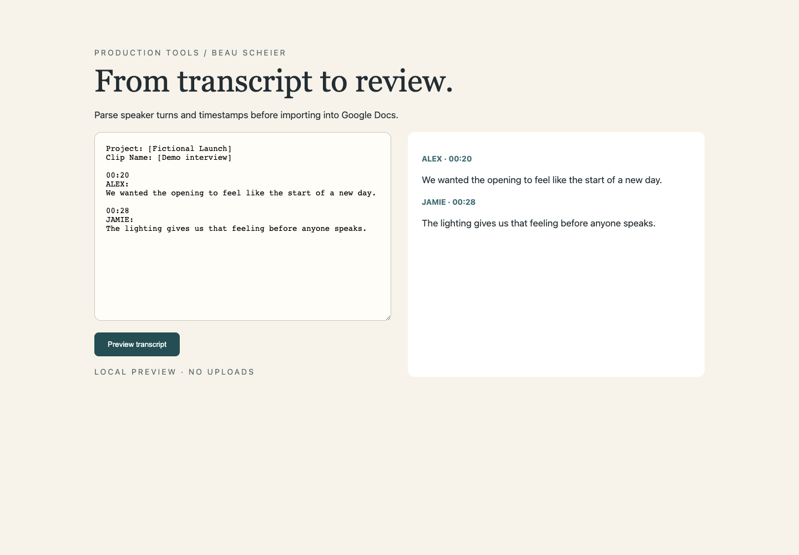

# Transcript Importer

**Turn raw transcripts into readable client-review documents.**

Transcript Importer accepts several common transcript layouts, checks them before import, and formats speaker turns and timestamps in Google Docs.

It addresses a small but recurring production task: turning machine-shaped text into something people can comfortably review.

## What it does

- Drag-and-drop transcript files with preflight reporting.
- Timestamp-before-speaker, speaker-before-timecode, and inline speaker formats.
- Speaker-turn formatting with optional timestamps.
- Several cleanup levels.
- An independent browser preview using the same parser.

## Run it

For a local preview, install Node.js 22+ and Python 3:

~~~sh
npm test
npm run demo
~~~

Open **http://localhost:8790**. This preview parses text locally; it does not upload files or write a Google Doc.

To use the actual importer:

1. Create a new Google Doc.
2. Open **Extensions → Apps Script**.
3. Paste `Code.gs` into the script editor and add `ImporterDialog.html` as an HTML file named `ImporterDialog`.
4. Save, reload the Doc, and choose **Transcript Import → Import Client Transcript(s)**.
5. Authorize document access when Google requests it, then try `examples/review.txt` in the new document.

The manifest is provided in `appsscript.json`. No script IDs, account configuration, or client transcripts are included.

## How it works

The parser and document writer are in `Code.gs`. `ImporterDialog.html` provides the Google Docs dialog. The local demo copies the same source into a browser-compatible script. Node VM tests exercise parsing and preflight without Google service access.

## Scope and limitations

The parser is heuristic: review speaker labels and cleanup results. Automated checks cover parsing and preflight; they do not replace a final Google Docs integration check. The browser preview demonstrates parsing and is not the document writer.

## About the work

Created by **Beau Scheier**, a commercial producer building tools for production, creative work, and coordinating development. Product direction and workflow design draw on that production practice; development includes AI assistance. This repository is a standalone portfolio edition.

[Production portfolio](https://prod.beauscheier.com/) · [More tools](https://github.com/OhandAredotjGN)

See [NOTICE.md](NOTICE.md) for rights and dependency attribution.
